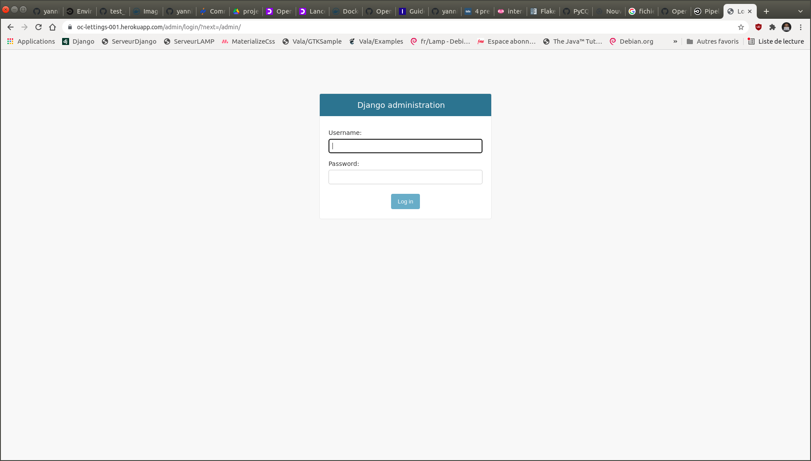

# Projet_P13
## Mettez à l'échelle une application Django en utilisant une architecture modulaire

### 1) Description de l'application

Ce projet consiste à améliorer le code et le déploiement du site **OC Lettings**.

Voici le lien vers le repository GitHub du site d'origine : [OC Lettings](https://github.com/OpenClassrooms-Student-Center/Python-OC-Lettings-FR).

Les points qui ont été améliorés et ajoutés sont les suivants :

- Réduction de diverses dettes techniques sur le projet
- Refonte de l'architecture modulaire
- Ajout d'un pipeline CI/CD utilisant CircleCI et Heroku
- Surveillance de l’application et suivi des erreurs via Sentry

Ci-après le schéma d'architecture globale du projet


#### 1.1) Organisation du projet

**Les dossiers et packages**

Le dossier `.circleci`contient un fichier `config.yml` avec les 3 étapes (jobs)  du pipeline CI/CD :

- 1) job `build-lint-test`: réalise les tâches de build, lint puis tests lors de la publication d'une modification sur n'importe quelle branche du projet.
- 2) job `build-and-push-docker-image` : c'est la phase de conteneurisation réalisée en cas de succès de l'étape 1 et uniquement sur la branche main; elle consiste à créer une image docker du projet puis à la pousser vers le repository sur Dockerhub.
- 3) job `heroku-deploy`: c'est l'étape de déploiement sur Heroku réalisée en cas de succès de l'étape 2 et uniquement sur la branche main.

Le dossier `images` contient les images affichées dans le présent fichier README.md.

Le package `lettings` contient le code de l'application `lettings` qui gère les objets de la classe `Letting`.

Le package `oc_lettings_site` contient le code de l'application principale du site (page d'accueil).

Le package `profiles` contient le code de l'application `profiles` qui gère les objets de la classe `Profile`.

Le package `projet_p13` correspond au projet au sens Django du terme (

**Les scripts et fichiers configuration**

Le fichier `.dockerignore` est l'équivalent pour docker du fichier `.gitignore`pour git. : il sert à exclure certains fichiers lors de la construction d'une image docker.

Le fichier `black.cfg` est le fichier de configuration de la commande `black` : il définit les fichiers et répertoires à exclure lors de l'exécution de la commande.

Le fichier `Dockerfile` contient les instructions nécessaires à la création d'une image docker du projet.

Le fichier `gunicorn.conf.py` contient les paramètres de configuration de la commande `gunicorn`.

Le fichier `gunicorn_starter.sh` est défini en tant que **ENTRYPOINT** dans le fichier `Dockerfile`. C'est le script bash qui est exécuté à chaque fois que l'on lance le container docker construit à partir du `Dockerfile`.

Le fichier `heroku_deploy.sh` est le script bash de déploiement du projet sur Heroku. Il est appelé par le job `heroku-deploy` défini dans le fichier `.circleci/config.yml`

Le fichier `pytest.ini` est le fichier de configuration de la commande `pytest`.

Le fichier `setup.cfg` est le fichier de configuration d'origine du projet.


#### 1.2) GitFlow du projet

Le projet est organisé en plusieurs branches :

- `p13_dev_linting` : branche de développement pour réduction de la dette technique (lint)
- `p13_dev_pluralize` : branche de développement pour réduction de la dette technique (pluralisation)
- `p13_dev_modular_architecture` : branche de développement pour mise en place d'une architecture modulaire
- `p13_dev_docker` : branche de développement pour travail de conteneurisation
- `p13_dev_sentry` : branche de développement pour mise en place de Sentry
- `circleci-project-setup` : branche pour tester le fichier de configuration du pipeline CI/CD dans CircleCI.
- `main` : branche principale


### 2) Installation du projet Projet_P13 sur votre machine

Sur votre poste de travail, créer un dossier dans lequel vous allez installer le projet.

On nommera par exemple ce dossier `projects`. (vous pouvez le nommer autrement, c'est juste pour avoir une référence dans la suite des explications)

Aller sur le dépôt github : https://github.com/yannis971/Projet_P13

Pour l'installation, il y a 2 méthodes possibles.

#### 2.1) Première méthode : Téléchargement du fichier zip

Dans l'onglet **<> Code** de la page mentionnée plus haut, cliquer sur le bouton **Code** puis sur **Download ZIP**

Placer le fichier zip dans le dossier `projects` et le dézipper.

Ouvrir un terminal et se déplacer dans la racine du projet dossier `projects/Projet_P13-main/`

Passer à l'étape 3 pour configurer l'environnement virtuel

#### 2.2) Deuxième méthode : Clonage du dépôt avec git

Copier le lien https : https://github.com/yannis971/Projet_P13.git

Ouvrir un terminal et se déplacer dans le dossier `projects` créé précédemment et taper la commande :

`git clone` suivi du lien https copié plus haut.

soit : `git clone https://github.com/yannis971/Projet_P13.git`

Se déplacer dans la racine du projet (dossier `projects/Projet_P13`) :

`cd /chemin_vers_le_dossier/projects/Project_P13`

Passer à l'étape 3 pour configurer l'environnement virtuel

### 3) Configuration de l'environnement virtuel

#### Remarque

Les commandes ci-dessous (notamment celles concernant l'installation de pip pour python3) sont valables sur un système d'exploitation Linux de type Debian ou de ses dérivés.

Pour Windows, on utilise python et pip.

Pour Mac OS, on utilise python3 et pip3.

#### 3.1) Installer pip pour python3 si ce n'est pas déjà fait

Si la commande `pip3 --version` renvoie une erreur alors il convient d'installer pip

`sudo apt-get update && sudo apt-get install python3-pip`

Si l'installation a réussi, la commande vous renverra une ligne comme indiqué ci-dessous

`pip 20.2.3 from /soft_desk/yannis/.local/lib/python3.8/site-packages/pip (python 3.8)`

#### 3.2) Créer un environnement virtuel et l'activer

Se placer à la racine du projet (dossier `projects/Projet_P13`) et lancer la commande :

`python3 -m venv venv`

Une fois l'environnement virtuel `venv` créé, l'activer avec la commande :

`source venv/bin/activate`

#### 3.3) Installer les dépendances du projet

Toujours à la racine du projet, lancer l'une des 2 commandes suivantes :

`pip3 install -r requirements.txt`

`python3 -m pip install -r requirements.txt`

### 4) Installation de Docker

Pour télécharger et utiliser Docker, vous devez créer un compte sur le [Docker Hub](https://hub.docker.com/).

Sur les systèmes d'exploitation Windows et Mac OS, vous pouvez installer [Docker Desktop](https://docs.docker.com/desktop/).

Sur les systèmes d'exploitation de type Linux, vous pouvez installer [Docker Engine](https://docs.docker.com/engine/install/) en choisissant la procédure d'installation adaptée à votre distribution Linux.

### 5) Variables d'environnement

En consultant le fichier `projet_p13/settings.py`, vous pouvez constater que j'utilise des variables d'environnement pour les données sensibles de configuration.

Les variables d'environnement nécessaires au déploiement en production sont préfixées du nom de l'application concernée pour une meilleure identification et aussi pour permettre d'écrire ce type de boucle dans le script bash de déploiement sur Heroku.

```
deploy_variables=`compgen -v | grep ^AWS_ && compgen -v | grep ^DJANGO_ && compgen -v | grep ^SENTRY_`
for deploy_variable in $deploy_variables
do
    heroku config:set $deploy_variable=${!deploy_variable} --app=$HEROKU_APP_NAME;
done
```

***Variables utilisées par Django***

- `DJANGO_SECRET_KEY`
- `DJANGO_SERVER_TYPE` : local pour serveur de test / production pour serveur de production
- `DEBUG` : True/False
- `DJANGO_ALLOWED_HOSTS`

***Variables pour accéder au compartiment Amazon S3 où sont stockées les ressources statiques de l'application***

- `AWS_ACCESS_KEY_ID`
- `AWS_SECRET_ACCESS_KEY`
- `AWS_STORAGE_BUCKET_NAME`

***Variables pour initialiser le SDK Sentry***

- `SENTRY_SDK_DSN`
- `SENTRY_TRACES_SAMPLE_RATE`

***Port par défault en local pour le serveur `gunicorn`***

- `PORT`

Pour créer ces variables d'environnement, il existe 2 méthodes :

- 1) les créer à l'aide de commande `export` : `export NOM_VARIABLE=VALEUR_VARIABLE`
- 2) créer un fichier `.env` dans le dossier `projet_p13`

Je propose dans Google Drive un répertoire partagé dans lequel vous trouverez 2 fichiers (`.env_local` et `.env_production` prêts à l'emploi, il suffit de les recopier en le renommant `.env`). Me contacter (mail : yannis.saliniere@gmail.com) si vous souhaitez avoir ces fichiers.

Autrement, vous devrez créer les variables d'environnement avec les valeurs de votre choix.


### 6) Commandes pour exécuter le Lint et les tests en local

Les commandes décrites dans ce paragraphe sont à exécuter en étant positionné à la racine du projet (i.e. dans le dossier `projects/Projet_P13`) et l'environnement virtuel doit être activé (`source venv/bin/activate`).

#### 6.1) Lint

**black**

[black](https://black.readthedocs.io/en/stable/) est un outil de formatage de code en Python respesctant la PEP8.

Pour vérifier que les sources Python du projet sont correctement formatés, lancez la commande :

`black . --check --config black.cfg`

Pour les formater :

`black . --config black.cfg`

**isort**

[isort](https://github.com/PyCQA/isort) est un package Python qui trie dans l'ordre alphabétique les modules et packages importés et les sépares en sections et types.

Pour vérifier que tous les imports effectués dans les sources du projet sont correctement triés, lanez la commande :

`isort . --check`

Pour les trier :

`isort .` ou `isort chemin_vers_le_fichier_à_tier`

Attention, il convient de lancer au préalable la commande `black` avant la commande `isort`.

**flake8**

[flake8](https://flake8.pycqa.org/en/latest/) est un outil Python qui vérifie le style et la qulité de votre code Python. Il vérifie checks divers points non couverts par `black`.

`flake8 .`

Cette commande est à lancer après les commandes `black` et `isort`.

#### 6.2) Tests

Avant de lancer pour la première fois les tests en local (variable d'environnement DJANGO_SERVER_TYPE différent de production), vous devez "collecter" les ressources statiques du projet, en exécutant la commande suivante en étant positionné dans le dossier `projects/Projet_P13` :

`python manage.py collectstatic`

Pour lancer les tests unitaires, utilisez Pytest comme suit :

`pytest -v`

Pour accéder au site :

- Lancer le serveur Django : `python manage.py runserver`
- Aller sur http://localhost:8000/


Pour accéder panel d'administration :

- Le serveur Django doit être démarré
- Aller sur http://localhost:8000/admin
- Connectez-vous avec l'utilisateur `admin`, mot de passe `Abc1234!`

### 7) Construction et test en local d'une image docker

Les commandes décrites dans ce paragraphe sont à exécuter en étant positionné à la racine du projet (i.e. dans le dossier `projects/Projet_P13`) et l'environnement virtuel doit être activé (`source venv/bin/activate`).

#### 7.1) Construire une image docker

La commande suivante permet de construire une image Docker du projet_p13 avec le tag(identifiant de version) égal à latest.

`docker build -t projet_p13:latest .`

#### 7.2) Lancer le conteneur Docker en local

`docker run --env-file projet_p13/.env -d -p 8000:8000 projet_p13:latest`

Ici le paramètre `--env-file` permet de passer un fichier contenant les variables d'environnement.


#### 7.3) Autres commandes

`docker ps` : lister les containers docker en cours d'exécution

`docker stop id_container` : arrêter l'exécution d'un container en cours d'exécution

`docker rmi -f projet_p13:latest` : supprimer l'image docker du projet_p13 avec le tag latest

`docker --help` ou `man docker` : obtenir de l'aide sur la commande `docker`

### 8) Pipeline CI/CD dans CircleCI

Cliquez [ici](https://app.circleci.com/pipelines/github/yannis971/Projet_P13?invite=true) pour accéder au pipeline CI/CD du Projet_P13.


### 9) Dockerhub

Cliquez [ici](https://hub.docker.com/r/yannissaliniere/projet_p13/tags) pour accéder aux images docker du projet_p13


### 10) Quelques captures d'écran du site https://oc-lettings-001.herokuapp.com

**Accueil**


**Panel d'administration**

Connectez-vous avec l'utilisateur `admin`, mot de passe `Abc1234!`



### 11) Licence

Le code de ce projet est sous licence libre **GNU GPL V3**

### 12) Questions/Aide/Support

En cas de problème ou pour toute question relative à ce projet, vous pouvez me contacter via l'un des canaux suivants :

* e-mail : yannis.saliniere@gmail.com

* twitter : https://twitter.com/YSaliniere

* rubrique "issues" du projet github : https://github.com/yannis971/Projet_P13/issues
